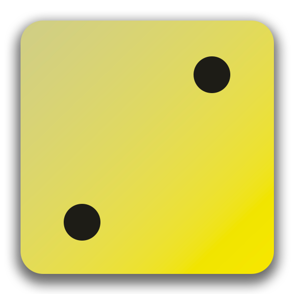
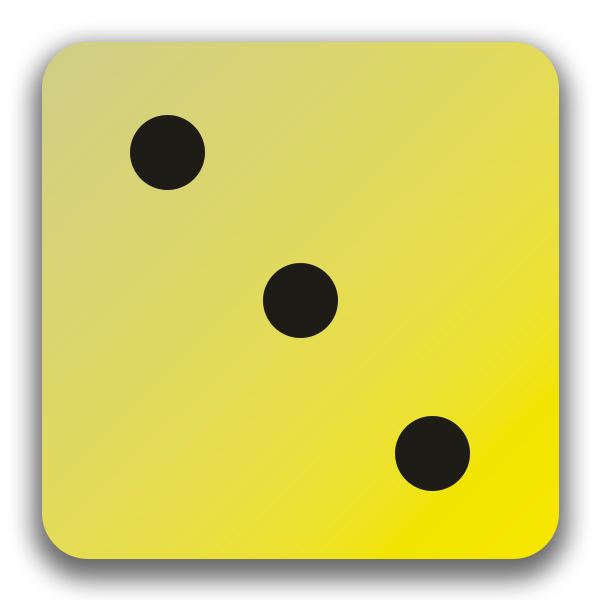
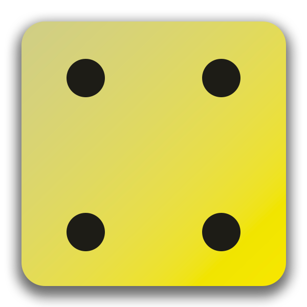
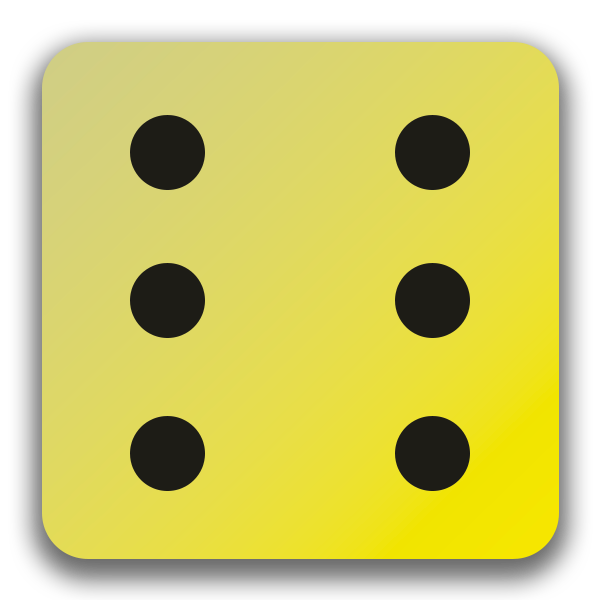

# Dice Roller App

<p align="center">
  
  
  
  
  
  
</p>

<p align="center">
  A small Flutter practice project with a purple gradient background and a working dice roller.
</p>

<p align="center">
  
  
  
</p>

## Overview

This app shows a dice on the screen and updates it every time the user presses the `Roll Dice` button.

It is a simple project, but it covers a few important Flutter basics:

- working with `StatefulWidget`
- updating the UI with `setState()`
- using local image assets
- splitting UI into smaller widgets
- building a simple but polished interface

## Features

- Purple gradient background
- Dice image changes on button press
- Button text styled for visibility on dark background
- Asset-based dice faces from `dice-1.png` to `dice-6.png`
- Clean beginner-friendly project structure

## Project Structure

```text
lib/
  main.dart
  gradiant_container.dart
  dice_roller.dart
  styled_text.dart

assets/
  image/
    dice-1.png
    dice-2.png
    dice-3.png
    dice-4.png
    dice-5.png
    dice-6.png
```

## Run Locally

```bash
flutter pub get
flutter run
```

If you want to run it directly on Android emulator:

```bash
flutter run -d emulator-5554
```

## What This Project Practices

- creating reusable widgets
- passing values through constructors
- managing widget state
- connecting UI actions to logic
- displaying app assets correctly with `pubspec.yaml`

## Tech Stack

- Flutter
- Dart
- Material Design widgets

## Notes

This repository started as a first Flutter learning project and was later turned into a small dice roller demo.  
The goal is to keep it simple, readable, and easy to build on while learning Flutter fundamentals.
